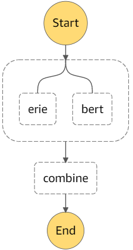
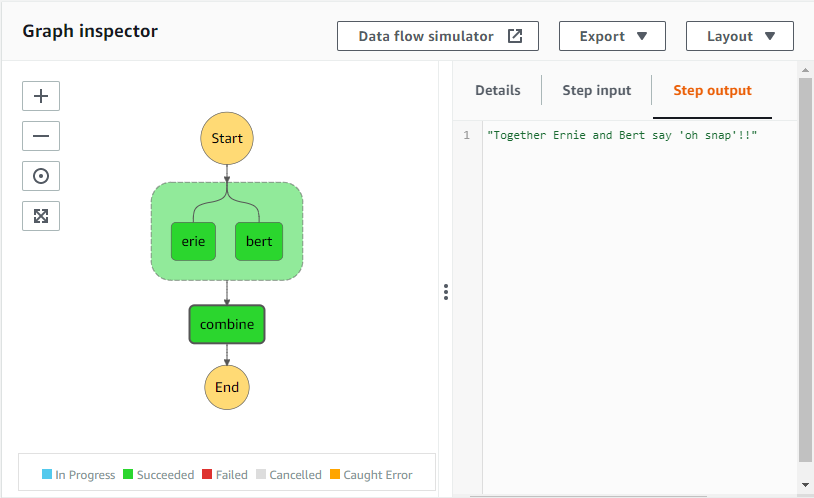

# aws-step-function
Small repo to demonstrate a step function implementation.

## Create Lambda Function Role
We need to create and IAM role that the can be attached to the lambda function when it is deployed.   
We'll reuse the `lambda-demo` role created in [this](https://github.com/daniel-fudge/aws-s3-trigger) repo.  

## Create Step Function Role
We need to create and IAM role that the can be attached to the step function when it is deployed, similar to the Lambda role created above.   
First create a `step-trust-policy.json` file that defines the required permissions as shown below.
```json
{
  "Version": "2012-10-17",
  "Statement": [
    {
      "Effect": "Allow",
      "Principal": {"Service": ["states.amazonaws.com"]},
      "Action": "sts:AssumeRole"
    }
  ]
}
```
Then create the IAM role in the CLI as shown below. Note I couldn't get this to work on Cloud9 even after running aws 
configure. Please let me know if you know why.
```shell
aws iam create-role --role-name step-function-lambda --assume-role-policy-document file://step-trust-policy.json
```

Next attached the `AWSLambdaRole` policy to the new role to allow the step funtion to invoke Lambda functions.   
This is performed with the following CLI command.
```shell
aws iam attach-role-policy --role-name step-function-lambda --policy-arn arn:aws:iam::aws:policy/service-role/AWSLambdaRole
```


## Create three Lambda functions populate the step function 
The following commands will create the three simple lambda functions.
```shell
cp -f lambda_ernie.py lambda_function.py
zip package.zip lambda_function.py
aws lambda create-function \
  --function-name ernie \
  --role arn:aws:iam::<your account id>:role/lambda-demo \
  --runtime python3.8 --timeout 10 --memory-size 128 \
  --handler lambda_function.lambda_handler \
  --zip-file fileb://package.zip
rm package.zip lambda_function.py

cp -f lambda_bert.py lambda_function.py
zip package.zip lambda_function.py
aws lambda create-function \
  --function-name bert \
  --role arn:aws:iam::<your account id>:role/lambda-demo \
  --runtime python3.8 --timeout 10 --memory-size 128 \
  --handler lambda_function.lambda_handler \
  --zip-file fileb://package.zip
rm package.zip lambda_function.py

cp -f lambda_combine.py lambda_function.py
zip package.zip lambda_function.py
aws lambda create-function \
  --function-name combine \
  --role arn:aws:iam::<your account id>:role/lambda-demo \
  --runtime python3.8 --timeout 10 --memory-size 128 \
  --handler lambda_function.lambda_handler \
  --zip-file fileb://package.zip
rm package.zip lambda_function.py
```

It may also be useful to update the package through the CLI with the following command.
```shell
cp -f lambda_ernie.py lambda_function.py
zip package.zip lambda_function.py
aws lambda update-function-code --function-name  ernie --zip-file fileb://package.zip
rm package.zip lambda_function.py
```

## Create the State Machine (Step Function)
First create the step function definition file `step-definition.json` as shown below with your account number. 
```json
{
  "Comment": "Parallel Demo",
  "StartAt": "Parallel State",
  "States": 
  {
    "Parallel State": {
      "Type": "Parallel",
      "Next": "combine",
      "Branches": [
        {
          "StartAt": "erie",
          "States": {
            "erie": {
              "Type": "Task",
              "Resource": "arn:aws:states:::lambda:invoke",
              "Parameters": {
                "FunctionName": "arn:aws:lambda:us-east-1:<your account id>:function:ernie:$LATEST",
                "Payload": {"input.$": "$"}},
              "OutputPath": "$.Payload",
              "End": true}}
        },
        {
          "StartAt": "bert",
          "States": {
            "bert": {
              "Type": "Task",
              "Resource": "arn:aws:states:::lambda:invoke",
              "Parameters": {
                "FunctionName": "arn:aws:lambda:us-east-1:<your account id>:function:bert:$LATEST",
                "Payload": {"input.$": "$"}},
              "OutputPath": "$.Payload",
              "End": true
            }
          }
        }
      ]
    },
    "combine": {
      "Type": "Task",
      "Resource": "arn:aws:states:::lambda:invoke",
      "Parameters": {
        "FunctionName": "arn:aws:lambda:us-east-1:<your account id>:function:combine:$LATEST",
        "Payload": {"input.$": "$"}},
      "OutputPath": "$.Payload",
      "End": true}
  }
}
```
Now create the step function with the following command.
```shell
aws stepfunctions create-state-machine --name step-demo \
  --definition "$(cat step-definition.json)" \
  --role-arn arn:aws:iam::<your account id>:role/step-function-lambda
```
This creates the flow between the three lambda functions as illustrated below.



## Invoke the step function
The following command invokes the step function.
```shell
aws stepfunctions start-execution \
  --state-machine-arn arn:aws:states:us-east-1:<your account id>:stateMachine:step-demo \
  --input '{"ernie": "oh", "bert": "snap"}'
```
You should see the following in the AWS State Machine console under the step function execution grap details.


## References
- [AWS SAM Repo](https://github.com/daniel-fudge/aws-sam-test)
- [AWS S3-Trigger Repo](https://github.com/daniel-fudge/aws-s3-trigger)
- [AWS CLI - Installation](https://docs.aws.amazon.com/cli/latest/userguide/install-cliv2-linux.html)
- [AWS CLI - Add permissions](https://awscli.amazonaws.com/v2/documentation/api/latest/reference/lambda/add-permission.html)
- [AWS CLI - Invoke Lambda](https://docs.aws.amazon.com/cli/latest/reference/lambda/invoke.html#examples)
- [AWS S3 API](https://awscli.amazonaws.com/v2/documentation/api/latest/reference/s3api/put-bucket-notification-configuration.html)
- [AWS Step Output Filter](https://docs.aws.amazon.com/step-functions/latest/dg/input-output-example.html)
- [AWS Lambda Runtimes](https://docs.aws.amazon.com/lambda/latest/dg/lambda-runtimes.html)
